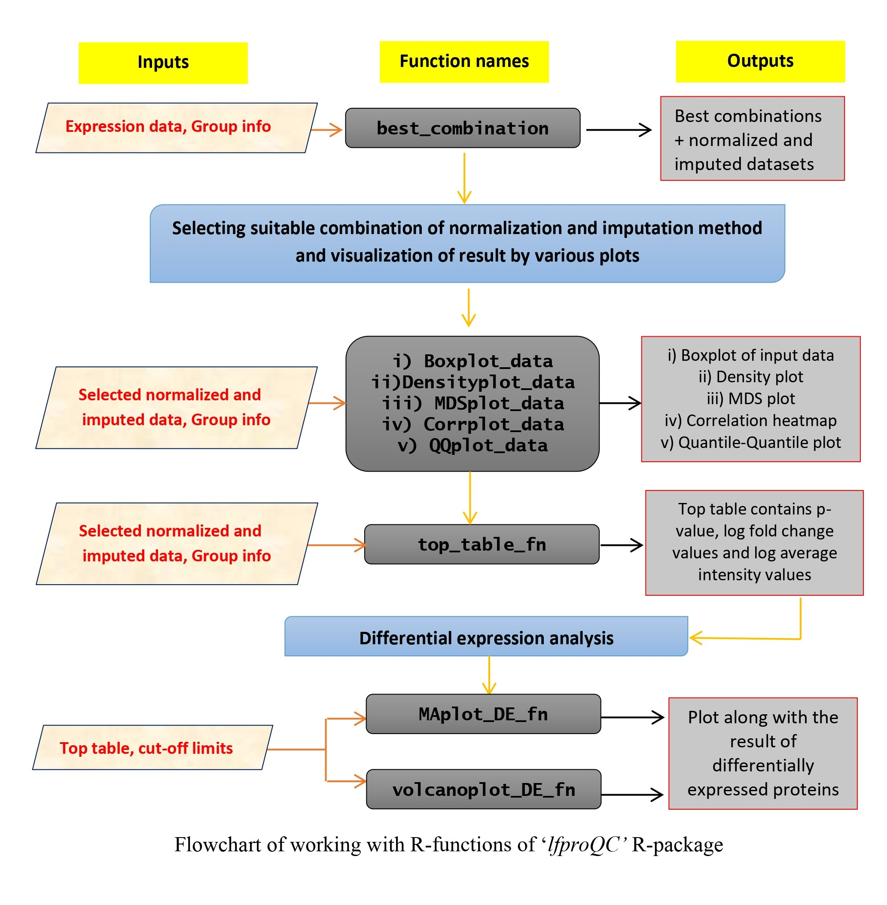

  
```{r, include = FALSE}
knitr::opts_chunk$set(
  collapse = TRUE,
  comment = "#>"
)

options(rmarkdown.html_vignette.check_title = FALSE)
```

**To attach the package in R studio**
```{r}
library(lfproQC)
```

**To find the best combination of normalization and imputation method for the dataset**
```{r, results='markup'}
yeast <- best_combination(yeast_data, yeast_groups)
```

**PCV values result**
```{r}
yeast$`PCV Result`
```

**PEV values result**
```{r}
yeast$`PEV Result`
```

**PMAD values result**
```{r}
yeast$`PMAD Result`
```

**Best combinations**
```{r}
yeast$`Best combinations`
```


**To visualize the normality by different exploratory plots **
---
  
*<span style="color:blue">1. By boxplot</span>*
```{r, out.width = "400px"}
Boxplot_data(yeast$`rlr_knn_data`) 
```

*<span style="color:blue">2. By density plot</span>*
```{r, out.width = "400px"}
Densityplot_data(yeast$`rlr_knn_data`)
```

*<span style="color:blue">3. By correlation heatmap</span>*
```{r, out.width = "400px"}
Corrplot_data(yeast$`rlr_knn_data`)
```

*<span style="color:blue">4. By MDS plot</span>*
```{r, out.width = "400px"}
MDSplot_data(yeast$`rlr_knn_data`)
```

*<span style="color:blue">5. By QQ-plot</span>*
```{r, out.width = "400px"}
QQplot_data(yeast$`rlr_knn_data`)
```

**Differential expression analysis**
---
  
*<span style="color:green">To Calculate the top-table values</span>*
```{r, results='hide'}
top_table_yeast <- top_table_fn(yeast$`rlr_knn_data`, yeast_groups, 2, 1)
```

**To visualize the different kinds of differentially abundant proteins, such as up-regulated, down-regulated, significant and non-significant proteins**
  
  
*<span style="color:green">By MA plot</span>*
```{r, out.width = "400px"}
de_yeast_MA <- MAplot_DE_fn(top_table_yeast,-1,1,0.05)
de_yeast_MA$`MA Plot`
```

*<span style="color:green">By volcano plot</span>*
```{r, out.width = "400px"}
de_yeast_volcano <- volcanoplot_DE_fn (top_table_yeast,-1,1,0.05)
de_yeast_volcano$`Volcano Plot`
```

Both of the above plots give same result.


*<span style="color:green">To obtain the overall differentially abundant proteins result</span>*
```{r, results= 'hide'}
de_yeast_MA$`Result `
```

*<span style="color:green">To find the up-regulated proteins</span>*
```{r, results='hide'}
de_yeast_MA$`Up-regulated`
```

*<span style="color:green">To find the down-regulated proteins</span>*
```{r, results='hide'}
de_yeast_MA$`Down-regulated`
```

*<span style="color:green">To find the other significant proteins</span>*
```{r, results='hide'}
de_yeast_MA$`Significant`
```

*<span style="color:green">To find the non-significant proteins</span>*
```{r, results='hide'}
de_yeast_MA$`Non-significant`
```

**The overall workflow of working with the 'lfproQC' package**
```{r setup, include=FALSE}
library(knitr)
```

```{r, echo=FALSE, out.width = "800px"}

```

**Session Information**
```{r}
sessionInfo()
```
